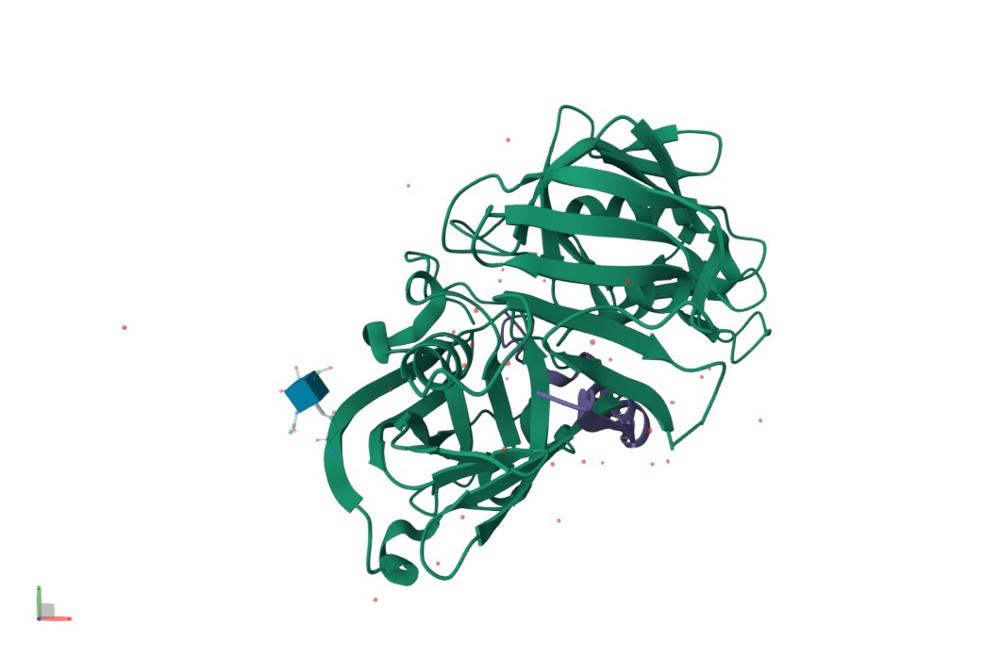
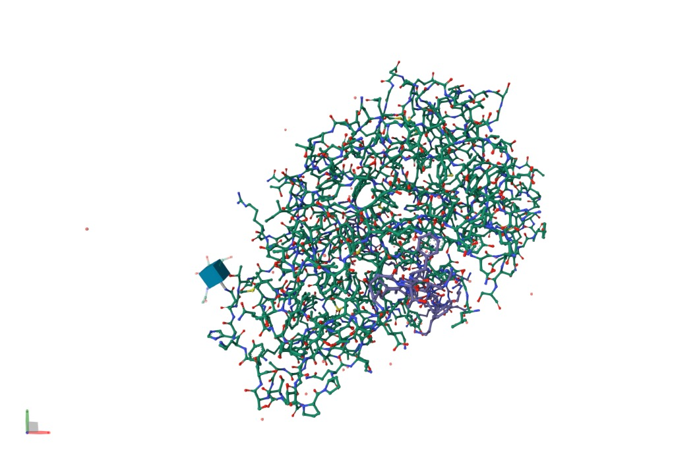
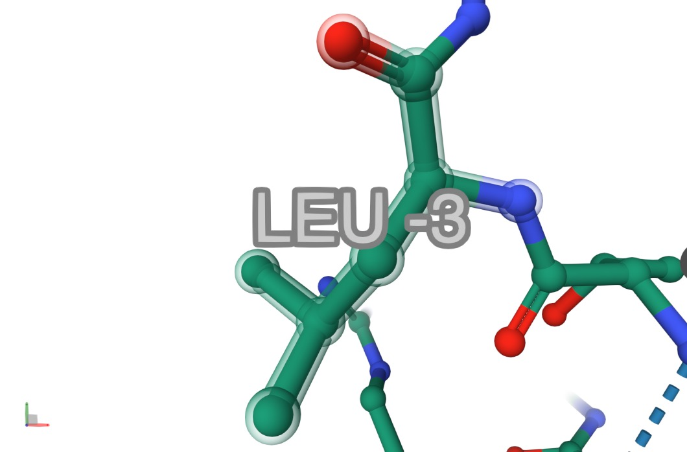
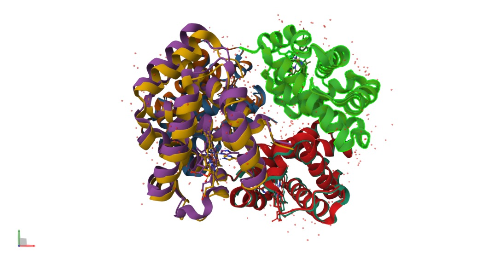
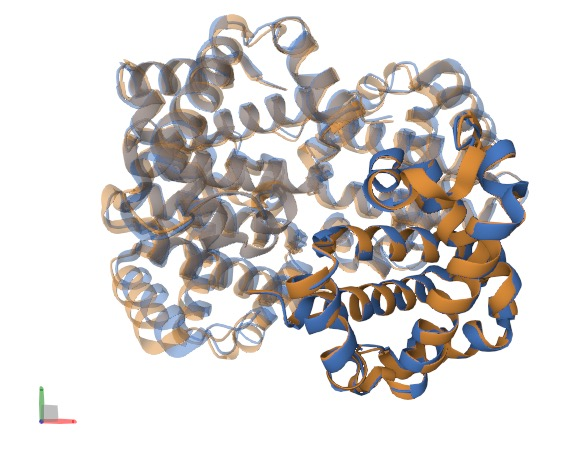

# Day 07 - 2026-04-23
## Morning
### Exercise 1 - Protein Alignment

#### h-HBA1 and h-HBB
Comparing alignment between 
- [h-HBA1](https://www.ncbi.nlm.nih.gov/protein/AAK61216.1)
- [h-HBB](https://www.ncbi.nlm.nih.gov/protein/CAG38767.1)

Alignment
```text
CLUSTAL O(1.2.4) multiple sequence alignment


AAK61216.1      -MVLSPADKTNVKAAWGKVGAHAGEYGAEALERMFLSFPTTKTYFPHFD------LSHGS	53
CAG38767.1      MVHLTPEEKSAVTALWGKVNV--DEVGGEALGRLLVVYPWTQRFFESFGDLSTPDAVMGN	58
                 : *:* :*: *.* ****..  .* *.*** *::: :* *: :*  *.         *.

AAK61216.1      AQVKGHGKKVADALTNAVAHVDDMPNALSALSDLHAHKLRVDPVNFKLLSHCLLVTLAAH	113
CAG38767.1      PKVKAHGKKVLGAFSDGLAHLDNLKGTFATLSELHCDKLHVDPENFRLLGNVLVCVLAHH	118
                 :**.***** .*:::.:**:*:: .::::**:**..**:*** **:**.: *: .** *

AAK61216.1      LPAEFTPAVHASLDKFLASVSTVLTSKYR	142
CAG38767.1      FGKEFTPPVQAAYQKVVAGVANALAHKYH	147
                :  **** *:*: :*.:*.*:..*: **:
```

Distance Matrix
```text 
#
#
#  Percent Identity  Matrix - created by Clustal2.1 
#
#

     1: AAK61216.1  100.00   42.86
     2: CAG38767.1   42.86  100.00
 ```

For h-HBA1 and h-HBB we see an identity-% of 42.86

#### h-HBB and mus-HBB
Comparing alignment between 
- [h-HBB](https://www.ncbi.nlm.nih.gov/protein/CAG38767.1)
- [mus-HBB](https://www.ncbi.nlm.nih.gov/protein/BAG16713.1)

Alignment
```text
CLUSTAL O(1.2.4) multiple sequence alignment


CAG38767.1      MVHLTPEEKSAVTALWGKVNVDEVGGEALGRLLVVYPWTQRFFESFGDLSTPDAVMGNPK	60
BAG16713.1      MVHLTDAEKSAVSCLWAKVNPDEVGGEALGRLLVVYPWTQRYFDSFGDLSSASAIMGNPK	60
                *****  *****:.**.*** ********************:*:******: .*:*****

CAG38767.1      VKAHGKKVLGAFSDGLAHLDNLKGTFATLSELHCDKLHVDPENFRLLGNVLVCVLAHHFG	120
BAG16713.1      VKAHGKKVITAFNEGLKNLDNLKGTFASLSELHCDKLHVDPENFRLLGNAIVIVLGHHLG	120
                ********: **.:** :*********:*********************.:* **.**:*

CAG38767.1      KEFTPPVQAAYQKVVAGVANALAHKYH	147
BAG16713.1      KDFTPAAQAAFQKVVAGVATALAHKYH	147
                *:*** .***:********.*******
```

Distance Matrix
```text
#
#
#  Percent Identity  Matrix - created by Clustal2.1 
#
#

     1: CAG38767.1  100.00   80.27
     2: BAG16713.1   80.27  100.00
```

For h-HBB and mus-HBB we see an identity-% of 80.27

#### Conclusion
We see that h-HBA1 and h-HBB have a high identity% of 42.86 and mus-HBB has a high identity% of 80.27. The orthologues are clearly more similar than the paralogues, despite the longer sequences and the species barrier.

### MSA
Comparing alignment between HBA of
- human
- mouse 
- chicken
- zebrafish
- salmon

Alignment using eggNog variants yielded inconsistent results. Probably due to different subunits selected. I haven't found a way to constrain the eggNog search to orthologues only. Thus, I used UniProt which seemed to have worked much better. At least now the numbers make more sense...

| Species | UniProt ID |
|---|---|
| Human (*Homo sapiens*) | **P69905** |
| Mouse (*Mus musculus*) | **P01942** |
| Dog (*Canis lupus familiaris*) | **P60529** |
| Chicken (*Gallus gallus*) | **P01994** |
| Zebrafish (*Danio rerio*) | **Q90487** |
| Atlantic salmon (*Salmo salar*) | **P11748** |

Alignment
```text
CLUSTAL O(1.2.4) multiple sequence alignment


chicken        MVLSAADKNNVKGIFTKIAGHAEEYGAETLERMFTTYPPTKTYFPHF-DLSHGSAQIKGH	59
dog            -VLSPADKTNIKSTWDKIGGHAGDYGGEALDRTFQSFPTTKTYFPHF-DLSPGSAQVKAH	58
human          MVLSPADKTNVKAAWGKVGAHAGEYGAEALERMFLSFPTTKTYFPHF-DLSHGSAQVKGH	59
mouse          MVLSGEDKSNIKAAWGKIGGHGAEYGAEALERMFASFPTTKTYFPHF-DVSHGSAQVKGH	59
zebrafish      MSLSDTDKAVVKAIWAKISPKADEIGAEALARMLTVYPQTKTYFSHWADLSPGSGPVKKH	60
salmon         TTLSDKDKSTVKALWGKISKSADAIGADALGRMLAVYPQTKTYFSHWPDMSPGSGPVKAH	60
                 **  **  :*. : *:.  .   *.::* * :  :* ***** *: *:* **. :* *

chicken        GKKVVAALIEAANHIDDIAGTLSKLSDLHAHKLRVDPVNFKLLGQCFLVVVAIHHPAALT	119
dog            GKKVADALTTAVAHLDDLPGALSALSDLHAYKLRVDPVNFKLLSHCLLVTLACHHPTEFT	118
human          GKKVADALTNAVAHVDDMPNALSALSDLHAHKLRVDPVNFKLLSHCLLVTLAAHLPAEFT	119
mouse          GKKVADALASAAGHLDDLPGALSALSDLHAHKLRVDPVNFKLLSHCLLVTLASHHPADFT	119
zebrafish      GKTIMGAVGEAISKIDDLVGGLAALSELHAFKLRVDPANFKILSHNVIVVIAMLFPADFT	120
salmon         GKKVMGGVALAVTKIDDLTTGLGDLSELHAFKMRVDPSNFKILSHCILVVVAKMFPKEFT	120
               **.:  .:  *  ::**:   *. **:***.*:**** ***:*.: .:*.:*   *  :*

chicken        PEVHASLDKFLCAVGTVLTAKYR	142
dog            PAVHASLDKFFAAVSTVLTSKYR	141
human          PAVHASLDKFLASVSTVLTSKYR	142
mouse          PAVHASLDKFLASVSTVLTSKYR	142
zebrafish      PEVHVSVDKFFNNLALALSEKYR	143
salmon         PDAHVSLDKFLASVALALAERYR	143
               * .*.*:***:  :. .*: :**
```

Distance Matrix
```text
#
#
#  Percent Identity  Matrix - created by Clustal2.1 
#
#

     1: chicken     100.00   66.67   70.42   71.13   54.23   50.00
     2: dog          66.67  100.00   83.69   81.56   52.48   53.19
     3: human        70.42   83.69  100.00   85.92   53.52   54.93
     4: mouse        71.13   81.56   85.92  100.00   54.23   55.63
     5: zebrafish    54.23   52.48   53.52   54.23  100.00   67.83
     6: salmon       50.00   53.19   54.93   55.63   67.83  100.00
```

This matrix is biologically consistent with the vertebrate phylogeny: mammals cluster tightly (~82-86% identity), the two teleosts cluster together (zebrafish-salmon ~68%), chicken sits intermediate between mammals and fish (~67-71% to mammals), and mammal-to-fish identity drops to ~52-55%, exactly as expected since identity tracks divergence time. 

### Exercise 2 - ClinVar
> 1. Fill the table below
> 2. These are germline variants. Find a variant that would fit oncogenicity & clinical impact for somatic variants

| Disease | Description | Gene | Example variant | Mutation type | Functional effect |
|---|---|---|---|---|---|
| **Hemochromatosis** | Excess iron absorption | HJV | NM_213653.3:c.959G>T | Missense | Likely LOF |
| **Thalassemia** (β-thalassemia) | Reduced/absent β-globin synthesis → microcytic anaemia | HBB | NM_000518.5:c.118C>T (p.Gln40Ter) | Nonsense | LOF (no functional β-globin) |
| **Cystic Fibrosis** | Defective chloride/bicarbonate transport across epithelia → thick mucus, lung and pancreatic disease | CFTR | NM_000492.4:c.1521_1523delCTT (p.Phe508del, "ΔF508") | In-frame deletion | LOF (misfolding, ER retention, degradation) |
| **Tay-Sachs disease** | Deficiency of β-hexosaminidase A → GM2 ganglioside accumulation in neurons | HEXA | NM_000520.6:c.1274_1277dupTATC | Frameshift (duplication) | LOF (premature stop, no enzyme activity) |

Somatic variant: KRAS

- Various carcinomas (colorectal, lung, pancreatic)
- Variant: NM_004985.5:c.35G>A (p.Gly12Asp, "G12D")

Tier I carcinogen; predicts resistance to anti-EGFR therapy (cetuximab/panitumumab) in colorectal cancer; KRAS G12C-specific inhibitors (sotorasib, adagrasib) are approved only for the G12C variant, so G12D currently lacks a direct targeted therapy but remains a major prognostic and therapy-selection biomarker.

## Afternoon
### Exercise 3 - UniProt
> Your protein of interest
> - Uniprot ID, protein Name, length, keywords, function
> - What domains are there? DNA-binding? Ligand-binding?
> - Gene Ontology?
> - Which mutations & diseases?
> - Sub-cellular location?
> - Which PTM?
> - Are there isoforms?
> - Orthologs / paralogs?

**Protein of interest: XIAP**
- Uniprot Link: https://www.uniprot.org/uniprotkb/P98170/entry
- Most potent endogenous caspase inhibitor; only IAP that inhibits both initiator (caspase-9) and effectors (caspase-3, -7)
- E3 ubiquitin ligase (and NEDD8 ligase) via RING; auto-ubiquitinates and ubiquitinates caspases, SMAC, RIPK1, CASP8, BCL2, TLE proteins
- Regulates NF-κB (TAB1, RIPK2/NOD), Wnt, ripoptosome suppression, copper homeostasis, autophagosome-lysosome fusion

| Field      | Value                                                                                          |
| ---------- |------------------------------------------------------------------------------------------------|
| UniProt ID | P98170 (XIAP_HUMAN)                                                                            |
| Name       | E3 ubiquitin-protein ligase XIAP / X-linked inhibitor of apoptosis                             |
| Gene       | XIAP (syn. BIRC4, API3, IAP3)                                                                  |
| Length     | 497 aa                                                                                         |
| Locus      | Xq25                                                                                           |
| Keywords   | Apoptosis, Ubl conjugation, Transferase (E3), Zinc, Metal-binding, Phosphoprotein, Cytoplasm, Nucleus, Innate immunity, Disease variant |

**Domains**

| Domain         | Residues          | Role                                          |
| -------------- | ----------------- | --------------------------------------------- |
| BIR1           | ~28-101           | Dimer; TAB1 binding, NF-κB                    |
| Linker + BIR2  | 124-162 + 163-234 | Inhibits caspase-3/-7                         |
| BIR3           | 256-349           | Inhibits caspase-9; SMAC binding site         |
| UBA            | post-BIR3 region  | Non-covalent ubiquitin binding                |
| RING           | ~437-497          | E3 ligase; Zn2+ coordinating                  |


- DNA binding: no
- Ligand binding: yes. IBM (AVPI) tetrapeptides, SMAC mimetics, Zn2+ in all BIRs and RING (CCHC in each BIR, CCCHCCCC in RING binding 2 Zn ions), Cu(I)/Cu(II) on BIRs

**Mutations & Diseases**

| Disease                                    | Mechanism                                                                                        |
| ------------------------------------------ |--------------------------------------------------------------------------------------------------|
| XLP-2 / XIAP deficiency (OMIM 300635)      | LoF variants -> HLH (often EBV-triggered), very-early-onset Crohn-like IBD, hypogammaglobulinaemia                     |
| Cancer (AML, pancreatic, lung, ovarian, prostate)    | Overexpression -> chemoresistance; target for SMAC mimetics (birinapant, xevinapant, tolinapant) |


- ~100 pathogenic variants reported; BIR2 hotspot disrupts RIPK2 binding and NOD signalling
- ClinVar: https://www.ncbi.nlm.nih.gov/clinvar/?term=XIAP%5Bgene%5D

**Subcellular location**

| Compartment          | Notes                                                  |
| -------------------- | ------------------------------------------------------ |
| Cytosol              | Predominant                                            |
| Nucleus              | Fraction; nuclear localisation regulated by RING       |
| Signalling complexes | RIPosome, ripoptosome, autophagic membranes            |

**PTMs**

| PTM                  | Site / enzyme              | Effect                                              |
| -------------------- | -------------------------- | --------------------------------------------------- |
| Phosphorylation      | S87 (AKT)                  | Reduces auto-ubiquitination, stabilises XIAP        |
| Phosphorylation      | S430 (TBK1 / IKKε)         | Promotes auto-ubiquitination and degradation        |
| Phosphorylation      | S40 (CDK1-cyclin B1)       | Inhibits caspase binding during mitosis             |
| Auto-ubiquitination  | RING-dependent             | Controls steady-state levels                        |
| Caspase-3 cleavage   | Between BIR2 and BIR3      | Separates caspase-3/-7 vs caspase-9 inhibition      |
| S-nitrosylation      | BIR cysteines              | Modulates caspase inhibition                        |
| Metal coordination   | BIRs (Zn), RING (2x Zn), BIRs (Cu)   | Structural / regulatory                   |

**Isoforms & Orthologs**

| Isoform              | Status                                                                  |
| -------------------- | ----------------------------------------------------------------------- |
| Canonical (497 aa)   | Single isoform on UniProt P98170                                        |
| XIAP-ΔRING           | Reported in literature/RefSeq; not annotated as separate UniProt isoform|

**Orthologs**

| Species                    | UniProt                  |
| -------------------------- | ------------------------ |
| Mouse (Mus musculus)       | Q60989                   |
| Rat (Rattus norvegicus)    | Q9R0I6                   |
| Zebrafish (Danio rerio)    | Q5XJ30                   |
| Xenopus                    | xiap (multiple entries)  |
| Drosophila                 | DIAP1, DIAP2 (distant)   |

**Paralogs**

| Gene  | Protein                |
| ----- | ---------------------- |
| BIRC1 | NAIP                   |
| BIRC2 | cIAP1                  |
| BIRC3 | cIAP2                  |
| BIRC4 | XIAP (this entry)      |
| BIRC5 | Survivin               |
| BIRC6 | Apollon / BRUCE        |
| BIRC7 | Livin / ML-IAP         |
| BIRC8 | ILP-2                  |

### Exercise 4 - PDB Part 1
> Read https://pdb101.rcsb.org/learn/exploring-the-structural-biology-of-health-and-nutrition
> - Use one of them as your protein of interest
> - Download the PDBx file, from the file
> - Use this guide https://mmcif.wwpdb.org/docs/user-guide/guide.html
> - Find information about the citation, sequence, composition of macromolecules, mutation if any
> - Open the Structure Tab (3D viewer) Change the view to ball and stick,
> - Add annotation of 3rd modeled amino acid residue (Gray is unmodeled)

**Protein of interest: 3VCM**
- PDB Link: https://www.rcsb.org/structure/3VCM

**Citation**
- Morales R, Watier Y, Bocskei Z. "Human Prorenin Structure Sheds Light on a Novel Mechanism of Its Autoinhibition and on Its Non-Proteolytic Activation by the (Pro)renin Receptor." J Mol Biol. 2012;421(1):100-111
- PubMed: 22575890
- DOI: https://doi.org/10.1016/j.jmb.2012.05.003

**Experimental Summary**

| Field            | Value                       |
| ---------------- | --------------------------- |
| Method           | X-ray diffraction           |
| Resolution       | 2.93 Å                      |
| Space group      | P 4(3) 2 2                  |
| Cell (a, b, c)   | 104.42, 104.42, 237.12 Å    |
| R-work / R-free  | 0.2118 / 0.2478             |
| Released         | 2012-05-23 (rev 1.4, 2024)  |

**Macromolecule composition**

| Entity | Type        | Description                              | UNP range | MW (Da)   | Copies | Chains |
| ------ | ----------- | ---------------------------------------- | --------- | --------- | ------ | ------ |
| 1      | polypeptide | Prorenin (mature renin region)           | 67-406    | 36 721.5  | 2      | A, B   |
| 2      | polypeptide | Prorenin activation peptide              | 24-66     | 5 115.1   | 2      | P, Q   |
| 3      | non-polymer | N-acetyl-β-D-glucosamine (NAG)           | -         | 221.2     | 1      | -      |
| 4      | water       | H2O                                      | -         | 18.0      | 97     | -      |

**Sequence**
```text
LTLGNTTSSVILTNYMDTQYYGEIGIGTPPQTFKVVFDTGSSNVWVPSSKCSRLYTACVY
HKLFDASDSSSYKHNGTELTLRYSTGTVSGFLSQDIITVGGITVTQMFGEVTEMPALPFM
LAEFDGVVGMGFIEQAIGRVTPIFDNIISQGVLKEDVFSFYYNRDSLGGQIVLGGSDPQH
YEGNFHYINLIKTGVWQIQMKGVSVGSSTLLCEDGCLALVDTGASYISGSTSSIEKLMEA
LGAKKRLFDYVVKCNEGPTLPDISFHLGGKEYTLTSADYVFQESYSSKKLCTLAIHAMDI
PPPTGPTWALGATFIRKFYTEFDRRNNRIGFALAR
```

**Mutations**
- `_entity.pdbx_mutation` field: not set
- `_struct_ref_seq_dif`: an internal deletion of residues 232-236 (S-E-N-S-Q) in entity 1 (chains A and B), relative to canonical UNP P00797

#### 3D Viewer
**Default View**


**Ball and Stick View**


**Annotated 3rd AA residue**


### Exercise 5 - PDB Part 2
> Find the PDB entry of hemoglobin structure that is wild type and mutation
> - Load them onto https://www.rcsb.org/3d-view/
> - Select by Chain (default: Residue)
> - Superimpose the mutated and wild type chain.
> - Look at the structural difference

**Selected Proteins**
- Hemoglobin (wild type): [2DN2](https://www.rcsb.org/structure/2DN2)
- Hemoglobin (mutation, sickle cell): [2HBS](https://www.rcsb.org/structure/2HBS)

 

Now looking only at the mutated B chain: 
- Orange: wild type (2DN2)
- Blue: mutation (2HBS)

_This view was created using [PDB Aligment](https://www.rcsb.org/alignment) and TM align._

 