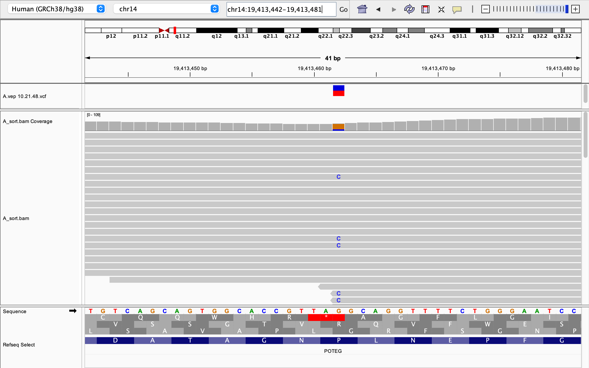
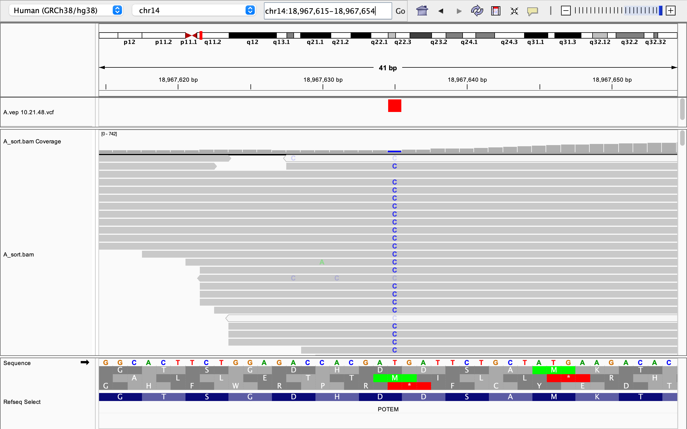
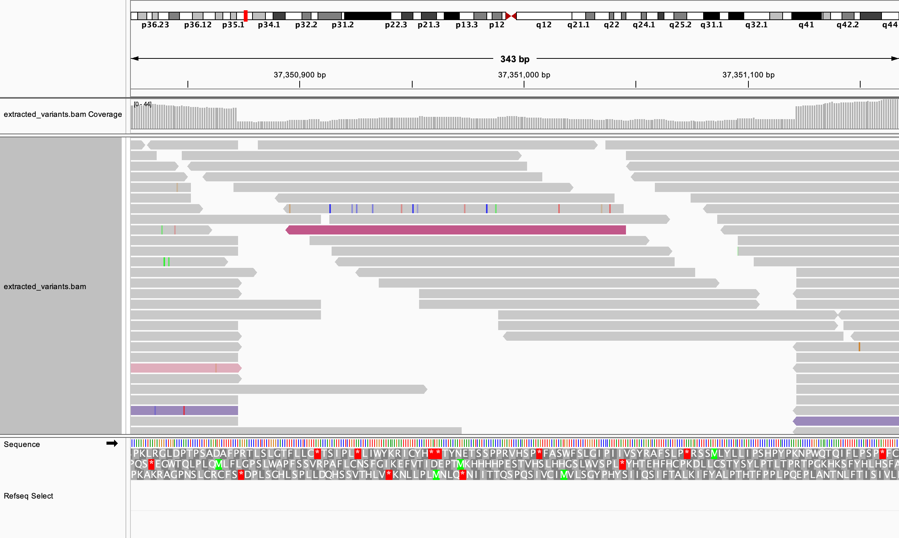
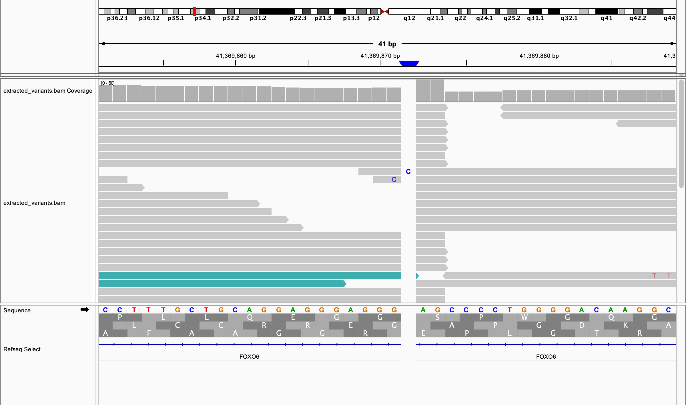
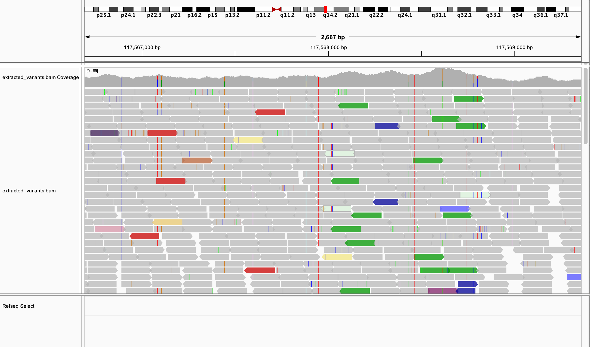

# Day 09 - 2026-04-28
## Exercise 1 - Impacts
> Work on sample A, identify two variants: one with a moderate impact and one with a low impact. For each variant, answer the following:
> - The variant type
> - The REF and ALT alleles
> - The genotype
> - The exact read count supporting the REF and ALT alleles
> - A screenshot of the variant captured from IGV

- Uploaded `A.vcf` to [VEP](https://www.ensembl.org/Homo_sapiens/Tools/VEP/)
- Downloaded annotations as `A.vep.vcf`
- Looked at variants

### Moderate Impact Sample (chr14:19413462)

- Variant type: Single nucleotide variant (SNV); transversion (G to C)
- REF / ALT alleles: G / C
- Genotype: Heterozygous
- Read count: 30,7

**Raw Variant**
```text
chr14	19413462	.	G	C	102.64	.	AC=1;AF=0.500;AN=2;BaseQRankSum=-3.401e+00;DP=42;ExcessHet=0.0000;FS=0.000;MLEAC=1;MLEAF=0.500;MQ=26.10;MQRankSum=0.742;QD=2.77;ReadPosRankSum=-1.689e+00;SOR=0.064;CSQ=C|3_prime_UTR_variant&NMD_transcript_variant|MODIFIER|POTEG|ENSG00000187537|Transcript|ENST00000547722.1|nonsense_mediated_decay|10/12||ENST00000547722.1:c.*588C>G||1609|||||rs199722113&COSV73630428|G|G/C||-1||HGNC|HGNC:33896||||2|||||0.1436||0&1|0&1||||||,C|missense_variant|MODERATE|POTEG|ENSG00000187537|Transcript|ENST00000547848.5|protein_coding|9/11||ENST00000547848.5:c.1301C>G|ENSP00000450853.2:p.Pro434Arg|1353|1301|434|P/R|cCt/cGt|rs199722113&COSV73630428|G|G/C||-1||HGNC|HGNC:33896|MANE_Select|NM_001005356.3||1|P1|tolerated(0.07)|benign(0.015)||0.1436||0&1|0&1||||||,C|missense_variant&NMD_transcript_variant|MODERATE|POTEG|ENSG00000187537|Transcript|ENST00000622767.4|nonsense_mediated_decay|9/12||ENST00000622767.4:c.1301C>G|ENSP00000482662.1:p.Pro434Arg|1353|1301|434|P/R|cCt/cGt|rs199722113&COSV73630428|G|G/C||-1||HGNC|HGNC:33896||||1||tolerated(0.1)|benign(0.054)||0.1436||0&1|0&1||||||	GT:AD:DP:GQ:PL	0/1:30,7:37:99:110,0,829
```

**Screenshot**

 

### Low Impact Sample (chr14:18967635)

**Description**
- Variant type: Single nucleotide variant (SNV); transition (T to C)
- REF / ALT alleles: T / C
- Genotype: Homozygous
- Read count: 1,68

**Raw Variant**
```text
chr14	18967635	.	T	C	2131.06	.	AC=2;AF=1.00;AN=2;BaseQRankSum=0.635;DP=91;ExcessHet=0.0000;FS=18.388;MLEAC=2;MLEAF=1.00;MQ=31.03;MQRankSum=-2.140e-01;QD=30.88;ReadPosRankSum=-1.688e+00;SOR=8.468;CSQ=C|synonymous_variant|LOW|POTEM|ENSG00000222036|Transcript|ENST00000547889.6|protein_coding|1/11||ENST00000547889.6:c.150T>C|ENSP00000448062.2:p.Asp50%3D|202|150|50|D|gaT/gaC|rs28412642|T|T/C||1||HGNC|HGNC:37096|MANE_Select|NM_001145442.1||1|P1||||0.4227|||1||||||,C|synonymous_variant&NMD_transcript_variant|LOW|POTEM|ENSG00000222036|Transcript|ENST00000552966.5|nonsense_mediated_decay|1/12||ENST00000552966.5:c.150T>C|ENSP00000448581.1:p.Asp50%3D|202|150|50|D|gaT/gaC|rs28412642|T|T/C||1||HGNC|HGNC:37096||||2|||||0.4227|||1||||||,C|synonymous_variant&NMD_transcript_variant|LOW|POTEM|ENSG00000222036|Transcript|ENST00000616847.1|nonsense_mediated_decay|1/12||ENST00000616847.1:c.150T>C|ENSP00000483980.1:p.Asp50%3D|202|150|50|D|gaT/gaC|rs28412642|T|T/C||1||HGNC|HGNC:37096||||1|||||0.4227|||1||||||	GT:AD:DP:GQ:PL	1/1:1,68:69:99:2145,176,0
```

**Screenshot**

 


## Exercise 2 - Variant types
> Using IGV, examine the structural variant (SV) in the `extract_variants.bam` file is this region
> - chr1: 37350877 - 37351115
> - chr1: 41369871 - 41369871
> - chr2: 117564013 - 117572037
> 
> and answer the following:
> - What type of structural variant do you believe this is?
> - Capture an IGV screenshot confirming the event. Make sure the reads are colored appropriately to support your conclusion.

### Chr1: 37350877 - 37351115

**Type of SV**

Deletion
- Coverage sharply decreases in the region
- Read pairs with unexpectedly large inferred insert sizes spanning the low-coverage region

**Screenshot**



### Chr1: 41369871 - 41369871

**Type of SV**

Insertion
- Region is only a single base wide
- Insertion of a C 

**Screenshot**
 

### Chr2: 117564013 - 117572037

**Type of SV**
Tandem duplication
- Duplication of approximately 8 kb
- Lots of green IGV coloring

**Screenshot**
 