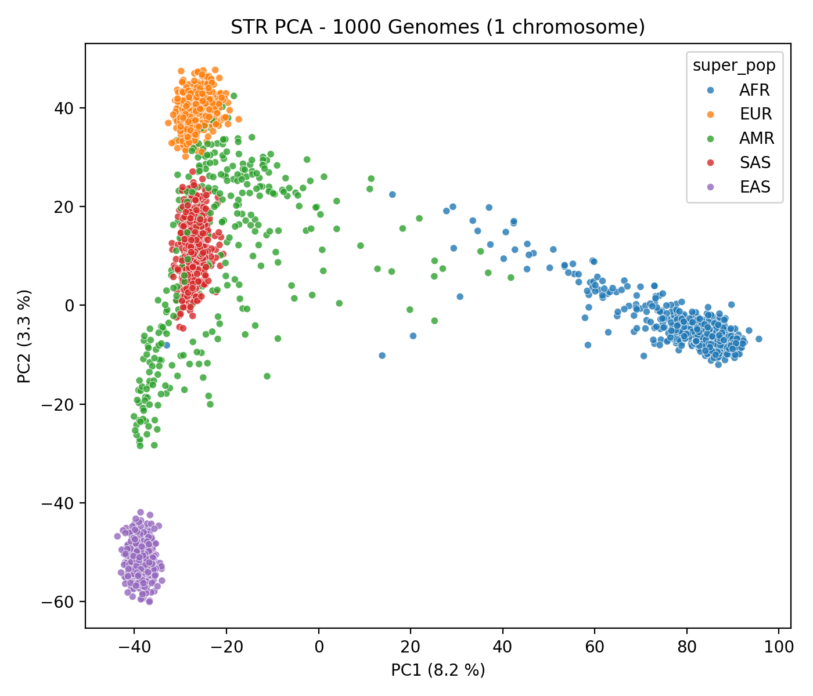
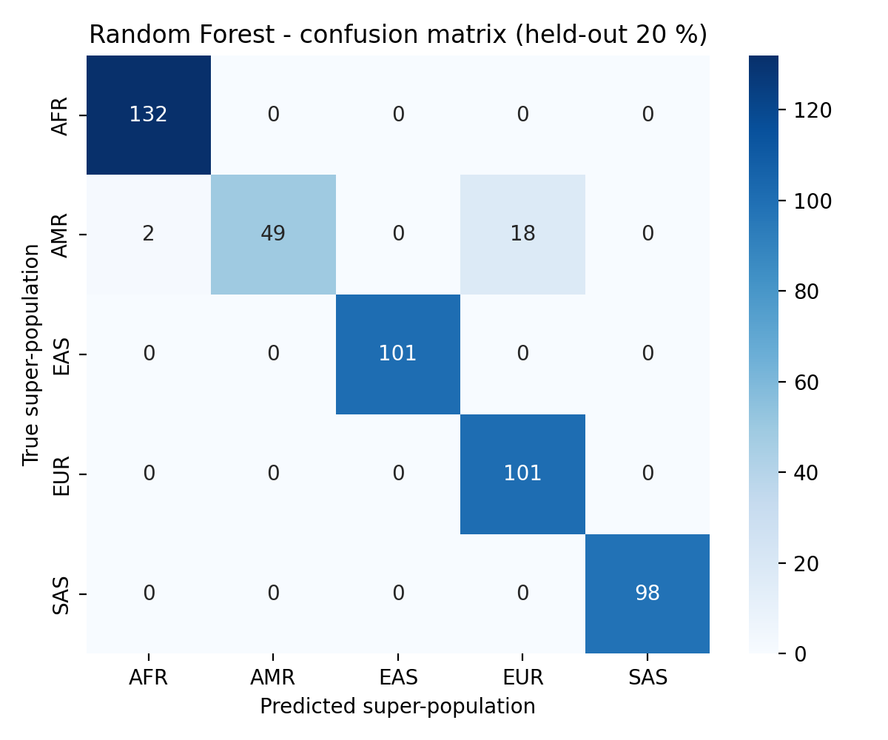

# Day 10 - 2026-04-29
## Exercise 1 - Population Str. Analysis SNPs
> Workflow
> - VCF file
> - PLINK convert 
> - LD Pruning 
> - PCA analysis 
> - ADMIXTURE Analysis

Two scripts:

- `20260429_install_tools.sh`: one-time setup of external binaries.
- `20260420_ex_01_script.sh`: end-to-end analysis pipeline.

### Analysis Pipeline
#### 1. Download
Get the chr1 variants from the 1000 Genomes Project plus the sample panel that tells us which population each individual belongs to. 

#### 2. Pre-filter with bcftools
Keep only common, biallelic SNPs. Rare variants and indels add noise without helping resolve ancestry, and removing them early makes everything downstream faster.

#### 3. Convert to PLINK format
PLINK's binary format is much smaller and faster to work with than VCF.

#### 4. Quality control
Drop variants with too many missing calls, strong deviations from Hardy-Weinberg equilibrium, or very low frequency. These are usually genotyping artefacts or too noisy to be informative.

#### 5. LD pruning
Nearby SNPs are often inherited together and carry redundant information. Pruning to a roughly independent subset prevents dense regions like the MHC from dominating the analysis.

#### 6. PCA
Reduces the data to a few axes that capture the main genetic differences between samples. In humans, these axes typically reflect continental ancestry.

#### 7. ADMIXTURE
Estimates each individual's ancestry as a mix of K source populations. Useful for admixed samples where PCA only shows a position between clusters. We test several values of K and pick the one best supported by cross-validation.

#### 8. Summary
Collects the labelled PCA table, ADMIXTURE results, and CV errors for plotting and interpretation.

## Exercise 2 - Population Str. Analysis using STRs
> Workflow
> CSV file
> Filtering
> PCA analysis
> Clustering analysis
> Supervised classification

Script for this exercise: `20260420_ex_02_script.py`

### Script
#### 1. Load the STR matrix
Read the CSV of STR genotypes for one chromosome. The script auto-detects whether samples are rows or columns (1000 Genomes IDs start with HG or NA) and orients the matrix as samples x loci. Cells are repeat lengths (mean of the two alleles), already numeric.

#### 2. Match samples to population labels
Load the 1000 Genomes panel and keep only samples that have both STR data and a population label. Without this overlap, no downstream evaluation against true ancestry is possible.

#### 3. Filter and prepare loci
Drop loci with too many missing values or near-zero variance, since they cannot help separate populations. Remaining missing values are filled with the locus median, and all loci are standardised so that highly variable loci do not dominate the analysis purely because of their scale.

#### 4. PCA
Reduces the data to a few axes capturing the main genetic differences. As with SNPs, the top axes are expected to reflect continental ancestry. PC1 vs PC2 is plotted and coloured by super-population to visually check the structure.

#### 5. Unsupervised clustering
K-means and hierarchical (Ward) clustering are applied to the PCA coordinates, with K set to the number of super-populations. The clusters are compared to the true labels using ARI, NMI, and silhouette scores. This tests whether STR variation alone carries enough signal to recover ancestry without any label information.

#### 6. Supervised classification
A Random Forest and an RBF-kernel SVM are trained to predict super-population from the STR profile, evaluated with 5-fold stratified cross-validation. A final Random Forest is then fit on an 80/20 train/test split to produce a confusion matrix and a ranked list of the most informative STR loci. This shows how well STRs can act as ancestry markers and which loci drive the signal.

### Output

PCA plot:

The first two components capture only ~11.5 % of the total variance (PC1: 8.2 %, PC2: 3.3 %), which is low compared to a genome-wide SNP PCA but somewhat expected, since we only look at chromosome 1. 
PC1 separates African from non-African, while PC2 separates East Asian from European/South Asian, which is the same continental-scale structure recovered from genome-wide SNP data in the 1000 Genomes paper.

Confusion matrix:

On the held-out 20 % test set, the classifier reaches roughly 96 % overall accuracy. Because AMR samples carry substantial European (and some African) ancestry, individuals with predominantly European admixture genuinely look like EUR at the STR profile level.