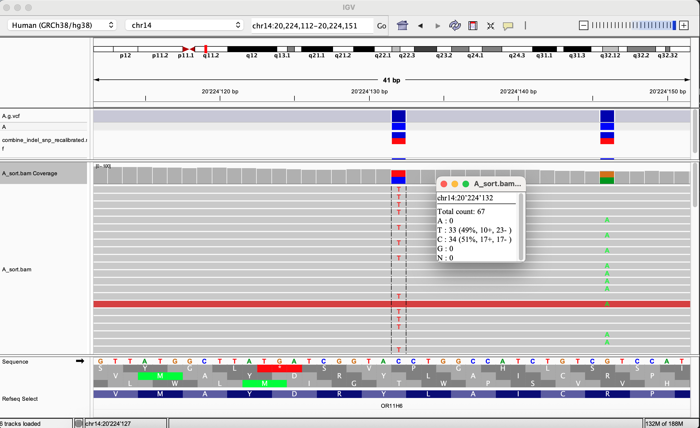
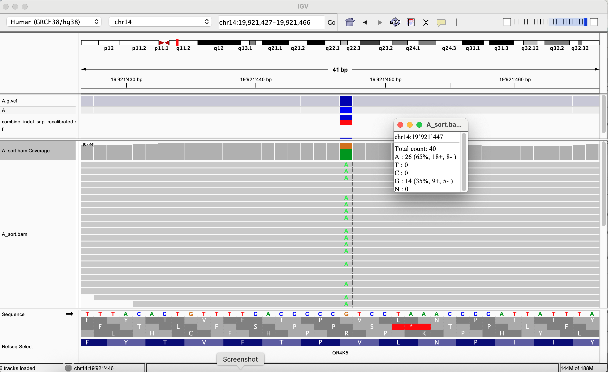
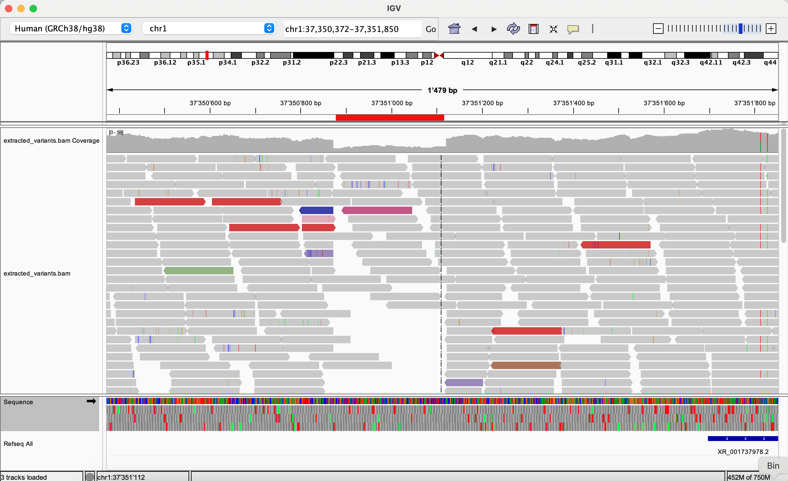
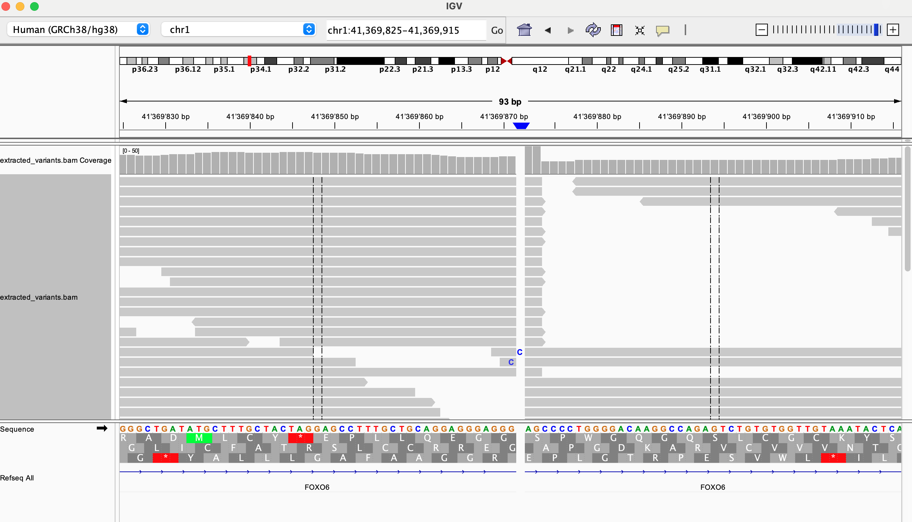
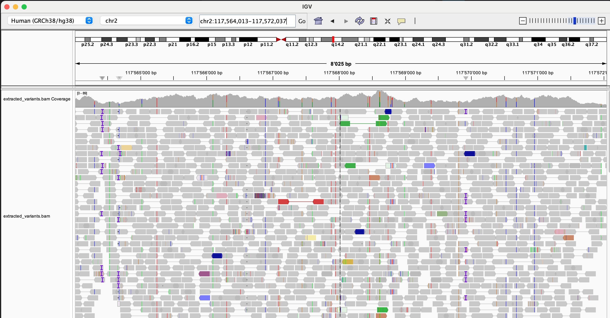

# Exercises Day 9

## Identify two variants: one with a moderate impact and one with a low impact. For each variant, answer the following:
* The variant type
* The REF and ALT alleles
* The genotype
* The exact read count supporting the REF and ALT alleles
* A screenshot of the variant captured from IGV
---
### Variant 1: LOW
* Variant type: Synonymous Variant
* REF Allele: C
* ALT Allele: C/T
* Genotype: TAC/TAT (Heterozygous)
* Exact read count supporting the REF and ALT alleles: C: 34, T: 33
* A screenshot of the variant captured from IGV: 

<!-- chr14:20’224’132 -->

----

### Variant 2: MODERATE
* Variant type: Missense Variant
* REF Allele: G
* ALT Allele: G/A
* Genotype: GTC/ATC (Heterozygous)
* Exact read count supporting the REF and ALT alleles: A: 26, G: 14
* A screenshot of the variant captured from IGV: 

<!-- chr14:19’921’447 -->

----
## Using IGV, examine the structural variant (SV) in the `extract_variants.bam` file is this region 
* chr1: 37350877 - 37351115
* chr1: 41369871 - 41369871
* chr2: 117564013 - 117572037

and answer the following:
* What type of structural variant do you believe this is?
* Capture an IGV screenshot confirming the event. Make sure the reads are colored appropriately to support your conclusion.

----
### chr1: 37350877 - 37351115:
Structural Variant Type: Deletion

### chr1: 41369871 - 41369871:
Structural Variant Type: Insertion

### chr2: 117564013 - 117572037:
Structural Variant Type: Not quite sure. There seems to be a region that has a lot of different regions that can be mapped to many different chromosomes so it might be a translocation or a region with a lot of repeats but I'm honestly not sure.
