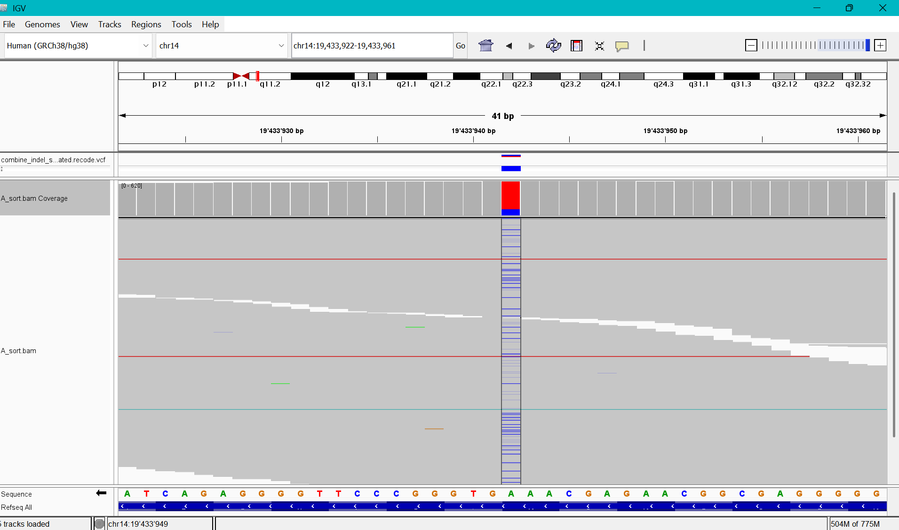
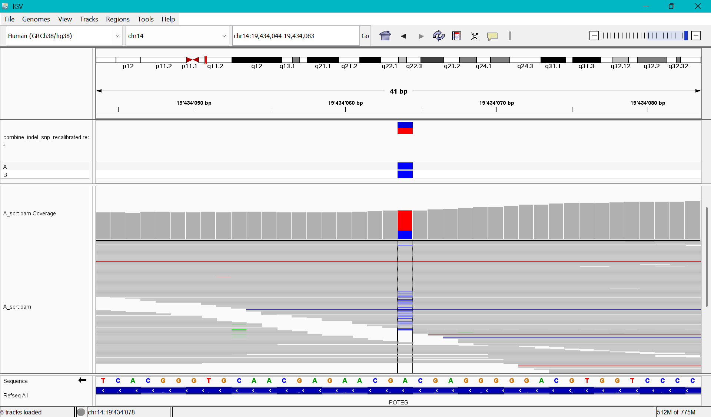
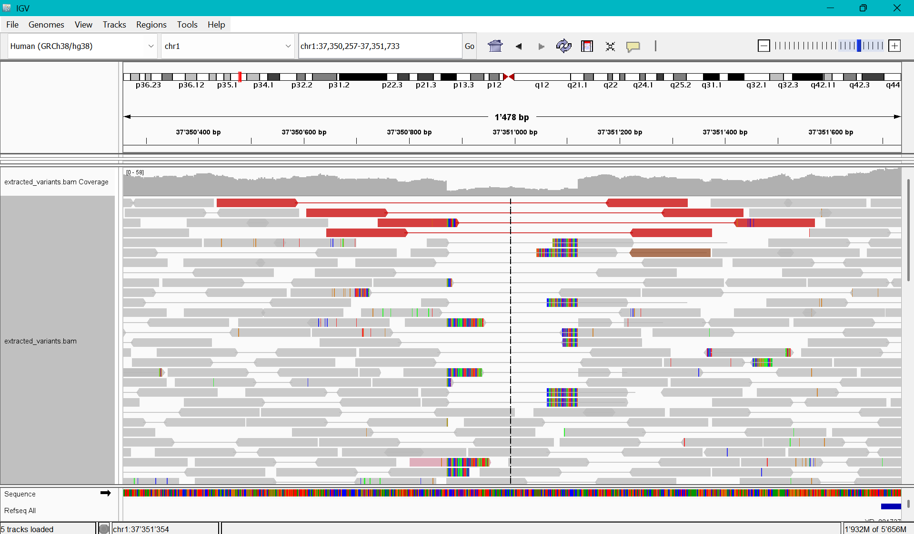
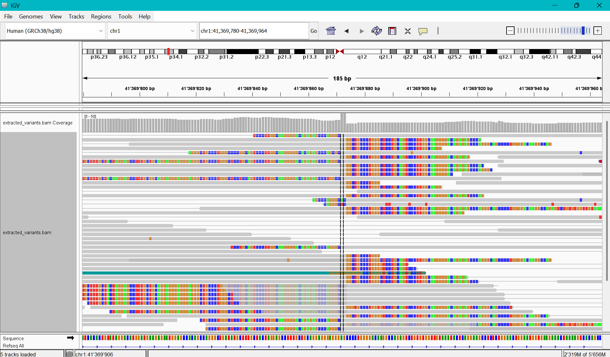
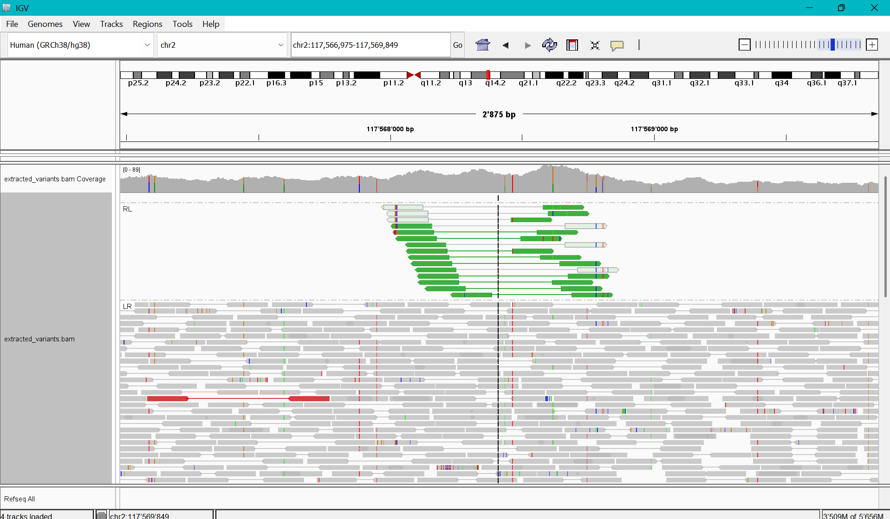

# Exercise IGV

## Analysis of variants with low and moderate effect

### Low impact
Location: chr14:19433942
- Variant type: Synonomous variant
- REF and ALT alleles: REF allele = "T", ALT alleles = "C"
- Genotype: unclear if homozygous REF or heterozygous.
- Read cound of REF and ALT alleles:
    - Nr. REF alleles = 489/614
    - Nr. ALT alleles = 125/614 

### Moderate impact
Location: chr14:19434064
- Variant type: Missense variant
- REF and ALT alleles: REF allele = "T", ALT alleles = "C"
- Genotype: unclear if homozygous REF or heterozygous.
- Read cound of REF and ALT alleles:
    - Nr. REF alleles = 489/614
    - Nr. ALT alleles = 125/614 

## Exercise 2:

### chr1: 37350877 - 37351115
The long gap between some of the reads and the abundance of soft-clipped bases before and after the segment, as well as the general drop of reads in this segment point towards a deletion. Because only about half of the reads are affected, I believe it to be a heterozygous deletion.

### chr1: 41369871 - 41369871
This is most likely an insertion because around this location, there is a dense cluster of mismatches and there are many aprupt read starts or ends at this location. It can't be a deletion because the read depth isn't affected.

### chr2: 117564013 - 117572037
The green reads at this location have RL orientation, which indicates a tandem duplication. 

